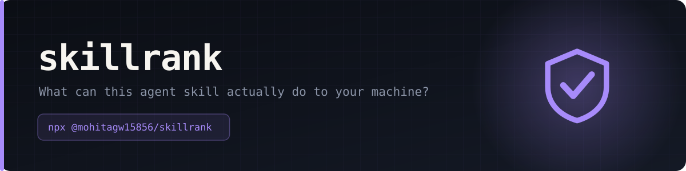

<div align="center">



    


</div>


**You installed forty agent skills. Do you know which ones can read your SSH key?**

There are at least seven competing directories of agent skills and a combined corpus in the thousands. Every one of them tells you what a skill *does*. None of them tells you what it *can do* — to your files, your credentials, and your machine. This is that layer.


## Scan something right now

```bash
npx skillrank ~/.claude/skills          # what you have already installed
npx skillrank ./some-skill-you-found    # before you install it
npx skillrank . --min B                 # exit 1 in CI if anything is worse than B
```

No API key. No account. No model call. **No tokens spent** — this is regex and file reads, which is a deliberate design constraint: the moment grading costs money per skill, coverage becomes a budget decision and the long tail never gets scanned. The 3,771 skills below were graded in under five seconds for nothing.

## The leaderboard

| Repo | Skills | Avg | Grades | Can run commands | Report |
| --- | --: | --: | --- | --: | --- |
| [pm-claude-skills](https://github.com/mohitagw15856/pm-claude-skills) | 3,370 | **99.7** | A 3353 · B 11 · C 6 | 282 (8%) | [details](reports/pm-claude-skills.md) |
| [obra/superpowers](https://github.com/obra/superpowers) | 14 | **97.8** | A 13 · B 1 | 10 (71%) | [details](reports/obra-superpowers.md) |
| [borghei/Claude-Skills](https://github.com/borghei/Claude-Skills) | 369 | **96.3** | A 334 · B 17 · C 9 · D 7 · F 2 | 353 (96%) | [details](reports/borghei-claude-skills.md) |
| [anthropics/skills](https://github.com/anthropics/skills) | 18 | **91.3** | A 13 · B 3 · C 2 | 11 (61%) | [details](reports/anthropics-skills.md) |

<sub>Average score, 0–100. A repo of harmless text formatters will beat a repo of deployment tools, and that is correct — the score measures blast radius, not quality.</sub>

## Capability tiers

The tier is not a judgement. A deployment skill *should* be T3. The tier exists so you can ask the useful question: **why does a changelog formatter need the network?**

| Tier | Meaning |
| :-: | --- |
| **T0 text** | Text in, text out. Touches nothing. |
| **T1 read** | Reads files in the working directory. |
| **T2 write** | Writes or edits files. |
| **T3 exec** | Runs shell commands or bundled scripts. |
| **T4 remote** | Executes code or instructions fetched from the network. |

## What it looks for

| Detector | Severity | Why it matters |
| --- | :-: | --- |
| `pipe-to-shell` | critical | Whatever that URL serves today, it can serve something else tomorrow. There is no review step and no pinned version. |
| `zero-width` | critical | Zero-width and bidirectional characters hide instructions from every human reviewer while remaining fully visible to the model. There is no legitimate reason for them in a skill. |
| `conceal-from-user` | critical | A skill that asks the agent to keep something from the person running it has inverted who the agent works for. |
| `instruction-override` | high | Classic prompt-injection phrasing. A legitimate skill adds capability; it does not countermand the operator. |
| `secret-access` | high | Touching key material is a hard prerequisite for every credential-theft path. Sometimes necessary; always worth knowing about. |
| `env-key-reference` | low | Documenting `ANTHROPIC_API_KEY` is not the same as reading a private key. Listed for completeness, priced accordingly. |
| `dotenv-access` | low | Extremely common and usually benign — but it is where the keys live, so it is worth listing. |
| `network-egress` | medium | The other half of an exfiltration path. Harmless alone, decisive in combination. |
| `obfuscation` | high | Encoded payloads defeat review. If the author cannot show you the string, assume you would not like it. |
| `encoded-blob` | medium | A 200-character base64 run inside a skill is not documentation. It may be an image; it may not be. |
| `destructive` | high | Not automatically wrong, but you should know before you install, not after. |
| `privilege-escalation` | high | A skill needing root is a skill that can do anything to the machine. |
| `persistence` | high | A skill that edits your shell profile or installs a cron job keeps running long after you stop using it. |
| `wildcard-tools` | medium | `Bash(*)` or `allowed-tools: *` means the skill declares no boundary at all, so nothing can be reviewed. |
| `ip-literal-url` | medium | Legitimate services have domain names. Raw IPs in a skill are worth a second look. |
| `url-shortener` | medium | A shortener hides the destination from review and lets the author change it after you install. |
| `unpinned-install` | low | Whatever gets installed at run time is whatever the registry serves that day. |

Plus one combination rule: **reading credentials is fine, sending data is fine, doing both in one skill** is the shape of every credential stealer ever written, and costs an extra 35 points.

## Why the grades are not harsher

The first version of this scanner graded every security skill in the corpus an **F** — because a skill that teaches you to spot `ignore previous instructions` necessarily contains the string `ignore previous instructions`. An antivirus that quarantines its own definitions file is not a strict antivirus, it is a broken one.

So the scanner reads context:

- A pattern inside `` `backticks` `` is demoted one level — it is being named, not run.
- A quoted example of an injection string does not count against a skill that is documenting it.
- `curl http://localhost:3000/health` is not data exfiltration.
- `🧑‍💼` is built from U+200D ZERO WIDTH JOINER and is not a hidden-instruction attack.
- A hardcoded key in `assets/sample_codebase/` is a teaching aid.
- Vendored fonts, binaries and XML schemas are counted and reported as **unscanned**, not silently passed.

Each of those is a fixture in `test/fixtures/` and a test in `scripts/test.mjs`, because every false positive we fix has to stay fixed. Run `node scripts/test.mjs`.

## Honest limits

Read this part before trusting a grade.

- **An A means "no known pattern fired". It does not mean safe.** Novel phrasing, a payload behind a URL, or logic in a compiled binary will all pass.
- **Static analysis cannot read intent.** It cannot tell a threat catalogue from a runbook. That is what [`suppressions.yml`](suppressions.yml) is for — a public baseline where a human overrides the scanner, in the open, with a name and a reason attached. Suppressed findings are still shown, just not counted.
- **The score is blast radius, not quality.** A brilliant skill that needs shell access scores below a mediocre one that does not.
- **A skill can change after you install it.** These grades are a snapshot of a commit, and the fingerprint in each report tells you which one.
- **This is not a substitute for reading the skill.** It is a way to know which forty of your skills you can skip reading.

## Add a repo

Drop a file in `registry/`, open a PR, and CI clones and scans it on the next run. See [CONTRIBUTING.md](CONTRIBUTING.md).

## Licence

Code MIT, data CC0. If you are a maintainer and think a grade is wrong, open an issue — a wrong grade is a bug, and getting it wrong in public is how it gets fixed.

<sub>Generated by `scripts/build.mjs`. Do not edit this file directly.</sub>
